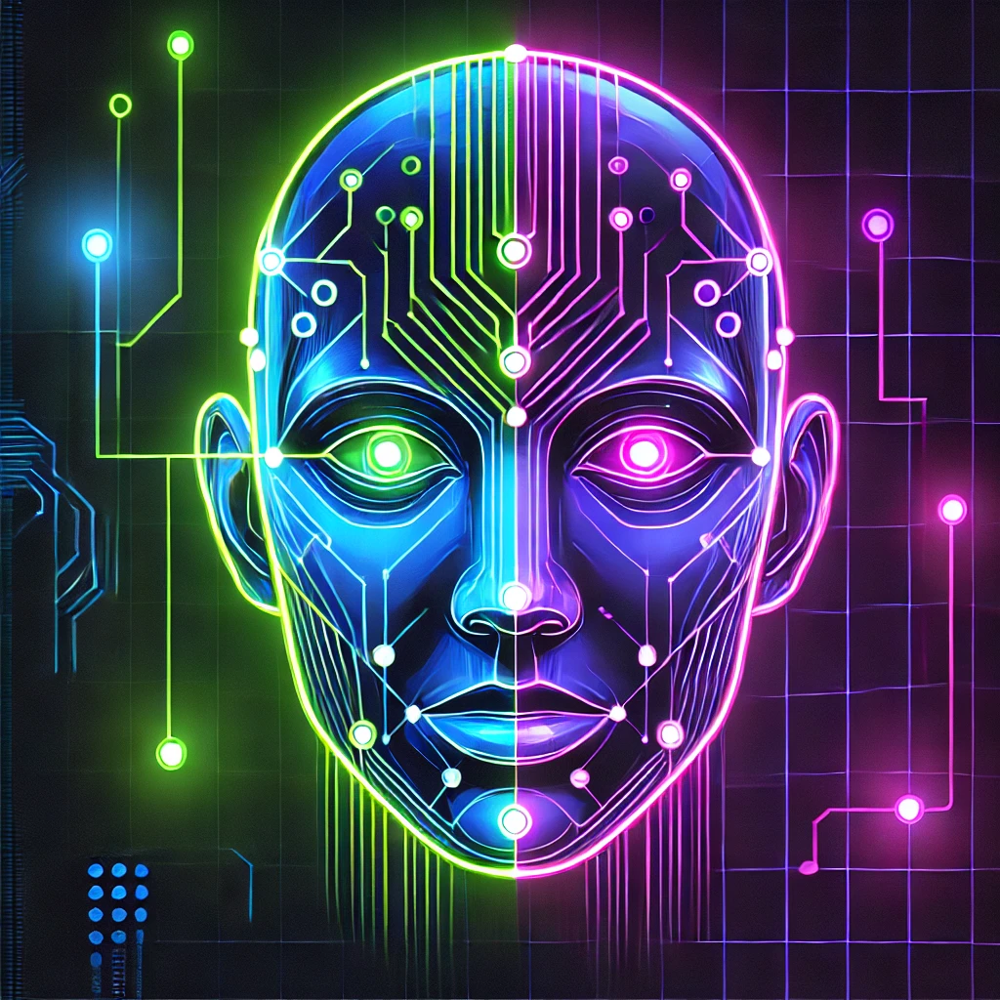

)

  

Este projeto tem como objetivo classificar imagens faciais em duas categorias: familiares e amigos. Para isso, utiliza técnicas avançadas de aprendizado de máquina e visão computacional aplicadas ao reconhecimento facial. No contexto do modelo, considera-se familiares como pessoas de ascendência asiática, enquanto amigos são pessoas de outras etnias.

## Tecnologias e Bibliotecas Utilizadas

- 🤖 **DeepFace**: Extração de embeddings faciais utilizando o modelo Facenet.

- 🦾 **TensorFlow/Keras**: Construção e treinamento de um modelo de classificação baseado em redes neurais artificiais.

- 🏜️ **OpenCV**: Processamento de imagens e detecção de rostos.

- 📈 **Matplotlib e Seaborn**: Visualização de resultados, incluindo a matriz de confusão.

- 💻 **Streamlit**: Interface interativa para upload de imagens e visualização dos resultados.

- 📃 **FPDF**: Geração de relatórios em PDF com estatísticas do modelo.
 

         
        
        
        
        
        
        
        
             
         

   

## Fluxo de Trabalho

- **Carregamento dos Dados**: As imagens são carregadas de diretórios de treino e validação.

- **Extração de Embeddings**: Cada imagem é processada pelo DeepFace, extraindo uma representação vetorial do rosto.

- **Construção e Treinamento do Modelo**: Uma rede neural densa com camadas `fully connected`, função de ativação `ReLU` e `dropout` para evitar overfitting.

- **Validação e Avaliação**:

    * Matriz de confusão para análise dos erros do modelo.

    * Relatório de classificação (índices de precisão, recall e F1-score).

- **Geração de Relatório**: Exportação dos resultados em formato PDF.

## Aplicabilidade

O projeto pode ser expandido para diversas aplicações, como controle de acesso, segurança digital e organização automática de álbuns de fotos baseados em grupos sociais.
    
